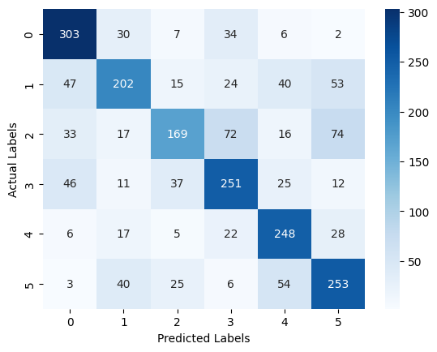

# Speech-Emotion-Recognition

**Objective:** Build and evaluate a speech emotion recognition (SER) system to effectively classify emotional states from spoken audio.

## CREMA Speech Dataset:

* **Description:**

  * Multimodal dataset for emotional expression analysis

  * Contains 7,442 audio-visual clips of actors speaking sentences

  * Features diverse demographic variations (age, gender, ethnicity)

* **Structure:**

  The dataset consists of 91 actors (48 male, 43 female, ages 20-74), with 12 unique sentences, 6 emotion categories (Anger, Disgust, Fear, Happy, Neutral, Sad), and 4 emotion intensity levels (Low, Medium, High, Unspecified)

* **File Naming Convention:**

  ActorID_SentenceID_Emotion_Intensity.extension

## Key Steps:

* **Data Exploration and Preprocessing:**

  Preprocess the audio data for feature extraction (e.g. pad the audio signals to the maximum length).

* **Feature Engineering:**

  * Choose two distinct feature spaces to represent the emotional information in the audio:

    * Time/Frequency Domain: Extract features like zero-crossing rate and energy to capture temporal characteristics.

    * Mel Spectrogram: Convert audio to spectrograms, creating visual representations of frequency content.

* **Model Development:**

  * **Time Domain Model Architecture:**

    **Feature Extraction:**

      * Conv1D layers (16, 32, 32, 64 filters) with increasing filter sizes (3, 3, 5, 7)  capture temporal patterns.

      * MaxPooling (pool size 2) downsamples for efficiency.
        
    **Dense Classification:**

      * Dense layers (64, 32 units) learn higher-level features.

      * 6-unit output with softmax for multi-class classification.

   * **Mel Spectogram Model Architecture:**
  
      **Feature Extraction:**
  
       *  Conv2D layers (16, 32, 64, 64, 128, 128 filters) with increasing filter sizes (3, 3, 5, 5, 7) capture temporal patterns.
    
       * MaxPooling (pool size 2) downsamples for efficiency.  
  
      **Dense Classification:**
      
       * Dense layers (128, 64 units) learn higher-level features.
        
       * 6-unit output with softmax for multi-class classification.

      
  ## Evaluation and Comparison:

  * **Time Domain Model**
    
    
    
    * Accuracy 0.5087
    
    * F1-Score 0.4962

    **Most confusing classes:**

      * Disgust and Neutral

      * Fear and Sad

  * **Mel Spectogram Model**
    
    
    
    * Accuracy 0.6386
    
    * F1-Score 0.6342

    **Most confusing classes:**

      * Fear and Happy

      * Fear and Sad
